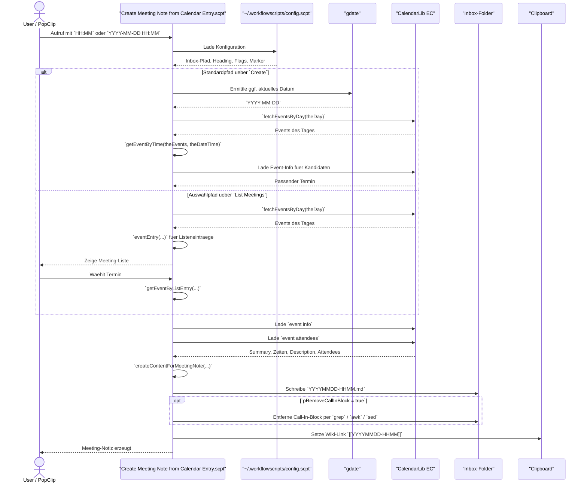

# Call Chain

Das folgende Sequenzdiagramm zeigt die Standard-Call-Chain des Workflows.

```mermaid
sequenceDiagram
    actor User as User / PopClip
    participant Script as "Create Meeting Note from Calendar Entry.scpt"
    participant Config as "~/.workflowscripts/config.scpt"
    participant GDate as "gdate"
    participant CalLib as "CalendarLib EC"
    participant FS as "Inbox-Folder"
    participant Clip as "Clipboard"

    User->>Script: Aufruf mit `HH:MM` oder `YYYY-MM-DD HH:MM`
    Script->>Config: Lade Konfiguration
    Config-->>Script: Inbox-Pfad, Heading, Flags, Marker

    alt Standardpfad ueber `Create`
        Script->>GDate: Ermittle ggf. aktuelles Datum
        GDate-->>Script: `YYYY-MM-DD`
        Script->>CalLib: `fetchEventsByDay(theDay)`
        CalLib-->>Script: Events des Tages
        Script->>Script: `getEventByTime(theEvents, theDateTime)`
        Script->>CalLib: Lade Event-Info fuer Kandidaten
        CalLib-->>Script: Passender Termin
    else Auswahlpfad ueber `List Meetings`
        Script->>CalLib: `fetchEventsByDay(theDay)`
        CalLib-->>Script: Events des Tages
        Script->>Script: `eventEntry(...)` fuer Listeneintraege
        Script-->>User: Zeige Meeting-Liste
        User->>Script: Waehlt Termin
        Script->>Script: `getEventByListEntry(...)`
    end

    Script->>CalLib: Lade `event info`
    Script->>CalLib: Lade `event attendees`
    CalLib-->>Script: Summary, Zeiten, Description, Attendees

    Script->>Script: `createContentForMeetingNote(...)`
    Script->>FS: Schreibe `YYYYMMDD-HHMM.md`

    opt `pRemoveCallInBlock = true`
        Script->>FS: Entferne Call-In-Block per `grep` / `awk` / `sed`
    end

    Script->>Clip: Setze Wiki-Link `[[YYYYMMDD-HHMM]]`
    Script-->>User: Meeting-Notiz erzeugt
```
